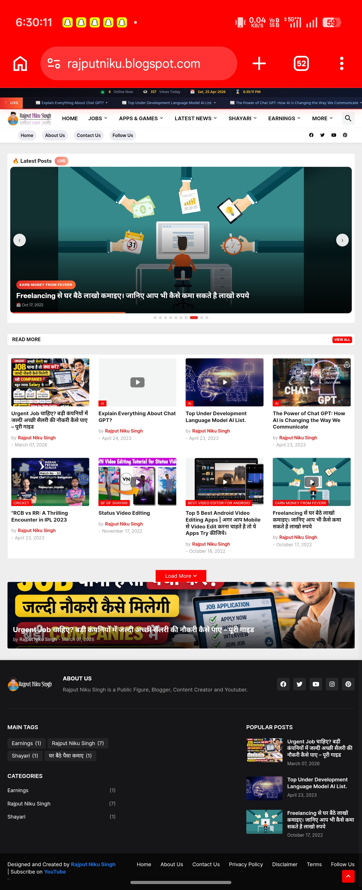
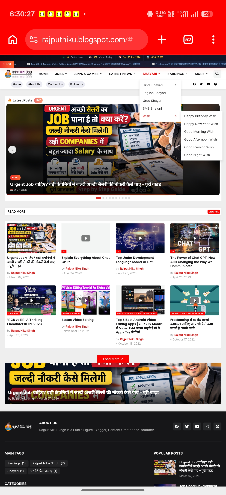
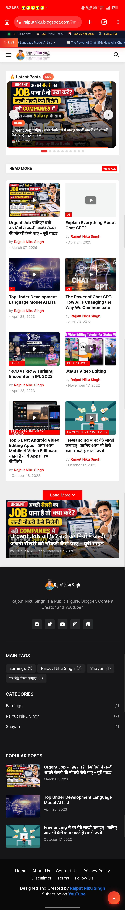
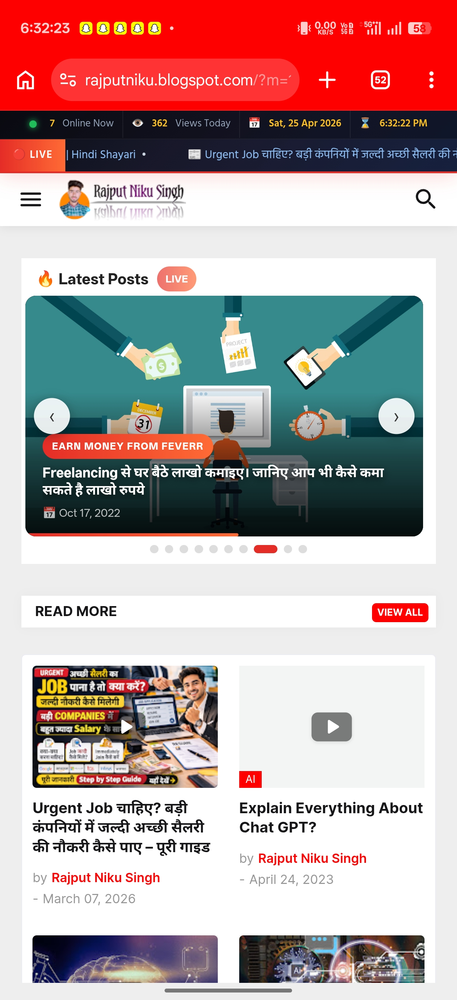
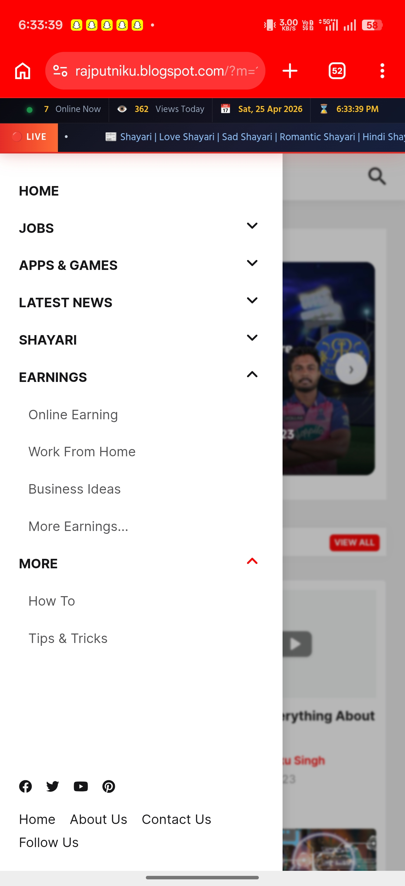
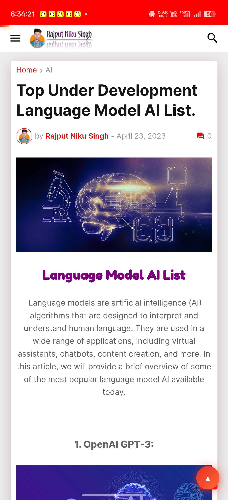
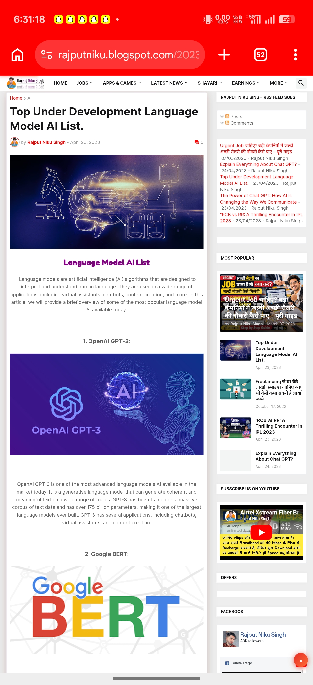

# 🌐 Responsive Blog Website — Rajput Niku Singh

> **A fully responsive blog website independently designed and developed using HTML5, CSS3, and Blogger Platform.**

🔗 **Live Website:** [https://rajputniku.blogspot.com](https://rajputniku.blogspot.com)

---

## 👨‍💻 About the Project

This is a **real, live, and fully functional** responsive blog website that I designed and developed **completely on my own** using HTML5 and CSS3 in VS Code, deployed on the Blogger platform.

The website is **not a template copy** — I customized every section including layout, navigation, color scheme, typography, and content structure to match my vision of a clean, fast, and user-friendly web experience.

It demonstrates my ability to:
- Build real-world responsive web interfaces independently
- Customize and optimize layouts using HTML & CSS
- Manage content, categories, and SEO for a live website
- Think from a user experience (UX) perspective

---

## 🖼️ Website Screenshots

### 🏠 Homepage — Full View

---

### 🔥 Latest Posts Section with Live Banner

---

### 📱 Mobile View — Homepage

---

### 📱 Mobile View — Hero Slider

---

### 🗂️ Navigation Menu — All Categories

---

### 📄 Blog Post — Inner Page View

---

### 🖥️ Desktop View — Full Article Page with Sidebar

---

## ✅ Key Features

| Feature | Details |
|--------|---------|
| 📱 Fully Responsive | Works perfectly on Mobile, Tablet & Desktop |
| 🔴 Live Ticker | Real-time scrolling news/post ticker on top |
| 🖼️ Hero Slider | Auto-sliding featured posts banner |
| 🗂️ Multi-Category Navigation | Jobs, Apps & Games, News, Shayari, Earnings, More |
| 🔍 Search Functionality | Built-in search for easy content discovery |
| 📊 Live Visitor Counter | Shows online users & daily views count |
| 🔗 Social Media Integration | Facebook, Twitter, YouTube, Pinterest, Instagram |
| 📰 Sidebar Widgets | Popular posts, RSS feed, subscribe section |
| 🎨 Custom Theme Design | Fully customized layout, colors & typography |
| 🔎 Basic SEO | Meta tags, structured content for search visibility |

---

## 🛠️ Tech Stack

- Frontend:    HTML5, CSS3
- Platform:    Blogger (Google)
- Editor:      VS Code
- Design:      Custom Theme Customization
- SEO:         Basic On-Page SEO

---

## 📁 Website Sections

- **HOME** — Featured slider + latest posts grid
- **JOBS** — Job-related articles and guides
- **APPS & GAMES** — Mobile apps reviews and tips
- **LATEST NEWS** — Current news articles
- **SHAYARI** — Hindi, English, Urdu, SMS Shayari + Wishes
- **EARNINGS** — Online earning, Work from Home, Business Ideas
- **MORE** — How-to guides, Tips & Tricks

---

## 📈 What This Project Demonstrates

- ✔ Front-end development with HTML & CSS
- ✔ Responsive design for all screen sizes
- ✔ Ability to plan and build multi-section websites
- ✔ UX thinking — clean navigation, readable layout
- ✔ Content management and publishing skills
- ✔ Real-world deployment (not just localhost)
- ✔ SEO awareness and online visibility
- ✔ Independent problem-solving ability

---

## 🚀 Future Improvements Planned

- [ ] Add JavaScript for dynamic features (dropdown animations, dark mode)
- [ ] Improve page speed and Core Web Vitals score
- [ ] Add contact form with email integration
- [ ] Convert to custom domain
- [ ] Implement Google Analytics dashboard
- [ ] Add more interactive UI components

---

## 👤 Author

**Santosh Kumar** *(also known as Rajput Niku Singh)*
MCA Graduate | Front-End Web Developer | IT Support Specialist

| Contact | Link |
|---------|------|
| 📧 Email | singh520santosh5@gmail.com |
| 💼 LinkedIn | [linkedin.com/in/rajputnikusingh](https://www.linkedin.com/in/rajputnikusingh) |
| 🌐 Website | [rajputniku.blogspot.com](https://rajputniku.blogspot.com) |
| 🐙 GitHub | [github.com/RajputNikuSingh](https://github.com/RajputNikuSingh) |

---

## ⚡ Availability

🟢 **Immediate Joiner**
- 📍 Currently in Noida, UP | Open to Relocate Anywhere in India
- 💼 Looking for: Web Developer | IT Support | Software Developer roles

---

*If you found this project interesting, feel free to ⭐ Star this repository!*
